# 基于 C51 单片机的经典俄罗斯方块：8*8 点阵屏 + 矩阵键盘的全流程实现详解【实时控制与状态机设计】

## 一、引言：
- 项目初衷：笔者想要通过8\*8点阵屏以及矩阵键盘深入理解嵌入式实时系统逻辑。同时，选择做俄罗斯方块也是为了重温经典游戏。
- 目标：实现一个可玩的俄罗斯方块核心功能，包括**方块移动 / 旋转**、**消行**、**积分系统**、**游戏状态管理（开始 / 结束 / 暂停）**。
- 适用人群：单片机初学者、电子爱好者，帮助深入理解嵌入式实时系统逻辑。

## 二、硬件设计：
### 1.核心元器件清单：
- 主控：STC89C52RC
- 显示：8\*8 点阵屏（配合74HC595串转并芯片，减少IO占用）
- 输入：4x4 矩阵按键（控制方块移动、旋转、暂停、以及游戏的重新开始）
- 辅助：11.0592MHz晶振、复位电路、电源模块

### 2.硬件接线图：
#### 8*8点阵屏：
我们首先看一下8\*8LED点阵屏内部结构原理图：

从图中可以看出，8\*8LED显示屏点阵共需要64个发光二极管组成，且每个发光二极管是放置在行线和列线的交叉点上，当对应的某一列置1电平，某一行置0电平，则相应的二极管就亮；要实现显示图形或字体，只需考虑其显示方式。**通过编程控制各显示点对应LED显示屏阳极和阴极端的电平，就可以有效的控制各显示点的亮灭**。而阴极端和阳极端一共有16根引脚，如果直接用8位单片机进行控制的话，需要占用单片机2个端口（如：P1,P2）

然而上述控制方法虽然简单，但是显而易见的，这种方法会造成大量IO口的浪费。**为了节省IO口的使用**，我们经常会利用**74HC595**这样的串并转换芯片作为驱动芯片。	 
74HC595是一款8位串行输入、并行输出（SIPO）的移位寄存器，内部包含三个核心模块：
- **移位寄存器**：负责接收串行数据，逐位 “左移” 暂存；
- **输出锁存器**：将移位寄存器的最终数据 “锁存”，驱动并行输出；
- **三态输出控制**：通过 OE 引脚控制输出是否有效（高电平 / 低电平 / 高阻态）。
接下来我们结合上述硬件图，详细介绍其引脚连接以及功能说明。

| 引脚 | 名称 | 功能说明 | 硬件连接 |
| ------ | ------ | ------------ | ------------ |
|14|`SER`|串行数据输入（Data Serial）：逐位输入待转换的串行数据|接单片机`MOSIO`引脚|
|11|`SRCLK`|移位时钟（Shift Clock）：上升沿触发，将`SER`的数据移入移位寄存器|接单片机`P6`引脚| 
|12|`RCLK`|锁存时钟（Register Clock）：上升沿触发，将移位寄存器数据锁存到输出端 |接单片机`P5.6`引脚|
|13|`OE` |输出使能（Output Enable）：低电平有效，使能并行输出；高电平时输出高阻态 |接单片机`P5.5`引脚|
|1-7、15|`Q0-Q7`|并行数据输出：锁存后，8 位数据从这里并行输出（驱动点阵屏、数码管等负载）|接8\*8点阵屏的行/列|
|10 |`MR`|复位（Master Reset）：低电平复位移位寄存器（图中接`VCC`，默认不复位|接电源`VCC`|
|9 |`QH'`|串行数据输出：级联时，将当前芯片的移位寄存器最高位输出到下一个芯片的`SER`|级联扩展时用|

**74HC595**的核心是 “**先串行移位，再并行锁存**”，确保输出稳定无闪烁。下面我们结合时序图做详细讲解：
~~（嘘，有人懒得画图就让Deepseek用ASCII模拟来画时序图了）~~ 
```bash
时间轴 →
        +---+   +---+   +---+   +---+   +---+   +---+   +---+   +---+       +---+
SRCLK:  |   |___|   |___|   |___|   |___|   |___|   |___|   |___|   |_______|   |___
        0   1   0   1   0   1   0   1   0   1   0   1   0   1   0   1       0   1
        ↑   ↑   ↑   ↑   ↑   ↑   ↑   ↑   ↑   ↑   ↑   ↑   ↑   ↑   ↑   ↑       ↑   ↑
        第1个上升沿  第2个上升沿  ...      第8个上升沿        RCLK上升沿

SER:    ____0________0________0________0________0________0________0________1________
        |                                                                          |
        （bit0=0） （bit1=0） （bit2=0） （bit3=0） （bit4=0） （bit5=0） （bit6=0） （bit7=1）

RCLK:   ____________________________________________________________|‾|__________
                                                                      1   ← 锁存触发

移位寄存器（8位，MSB→LSB）：
初始: 00000000 
第1次SRCLK后: 00000000（左移，SER=0 进入最低位）
第2次SRCLK后: 00000000（左移，SER=0 进入最低位）
...
第7次SRCLK后: 00000000（左移，SER=0 进入最低位）
第8次SRCLK后: 10000000（左移，SER=1 进入最低位，最高位变为1）

输出锁存器（Q0~Q7）：
RCLK上升沿前: 00000000（保持上一次锁存值）
RCLK上升沿后: 10000000（复制移位寄存器数据，并行输出）
```

1. **移位阶段**：串行数据逐位移入
触发条件：`SRCLK`产生**上升沿**（从低到高跳变）。
每次`SRCLK`上升沿，`SER`输入的1位数据（0或1）被**移入移位寄存器的最低位**；移位寄存器内已有的数据整体**左移一位**，最高位会被 “挤” 到`QH'`引脚（用于级联）。
> 若需要控制超过 8 路输出（比如 16 位、24 位），可通过 QH’ 引脚级联多片 74HC595：
> 1. 将前一片的`QH'`连接到 后一片的`SER`；
> 2. 所有芯片的`SRCLK`、`RCLK`、`OE`引脚分别并联（由单片机统一控制）；
> 3. 发送数据时，先送完第一片的8位，继续送第二片的8位（总数据长度为`n×8`位，n为芯片数）；
> 4. 锁存时，所有芯片同时触发`RCLK`，实现多片并行输出。

例如：要传输8位数据0x80（BIN：`10000000`），需执行8次“`SER`送位+`SRCLK`上升沿”：
第1次：`SER=0` → 移位寄存器：`00000000`（初始）→ 左移后`00000000`（最低位进0）；
……（中间6次送0）
第8次：`SER=1` → 移位寄存器：`10000000`（左移后，最高位为1）。
2. **锁存阶段**：移位数据批量输出
触发条件：`RCLK `产生上升沿。
当8位数据全部移入移位寄存器后，`RCLK`上升沿**将移位寄存器的内容复制到输出锁存器**；输出锁存器直接驱动`Q0-Q7`引脚，输出并行数据。**移位过程中，输出锁存器的数据不会变化（避免闪烁），只有锁存时才更新输出。**
3. **输出控制**：三态模式灵活调控
`OE=低电平`：输出锁存器的数据正常输出（高电平 / 低电平，驱动负载）；
`OE=高电平`：输出进入**高阻态**（相当于引脚与外部电路 “断开”，可用于级联时暂时关闭输出）。
>**实际移位过程详细示例：**
>假设要发送数据0b10110010（0xB2）：
>
>|步骤	|i	|SER值	|移位寄存器状态	|SCK动作|
>| -- | -- | -- | -- | -- |
>|1	|7	|1	|10000000	|0→1→0|
>|2	|6	|0	|01000000	|0→1→0|
>|3	|5	|1	|10100000	|0→1→0|
>|4	|4	|1	|10110000	|0→1→0|
>|5	|3	|0	|01011000	|0→1→0|
>|6	|2	|0	|00101100	|0→1→0|
>|7	|1	|1	|10010110	|0→1→0|
>|8	|0	|0	|01001011	|0→1→0|
>
>关键时序参数：
>|参数	|符号	|最小值	|典型值	|最大值	|单位	|说明|
>| -- | -- | -- | -- | -- | -- | -- |
>|时钟频率	|f_SCK	|-	|-	|25	|MHz	|最大移位频率|
>|时钟高时间	|t_H	|13	|-	|-	|ns	|SCK高电平时间|
>|时钟低时间	|t_L	|13	|-	|-	|ns	|SCK低电平时间|
>|建立时间	|t_SU	|20	|-	|-	|ns	|SER在SCK↑前的稳定时间|
>|保持时间	|t_HO	|5	|-	|-	|ns	|SER在SCK↑后的保持时间|
>|锁存时间	|t_LAT	|-	|-	|20	|ns	|RCK↑到输出有效|


一个74HC595具有8个驱动输出端（`QA-QH`），那么我们为了控制8\*8点阵屏的16个引脚就仅需2个74HC595作为驱动芯片即可。通过第一片74HC595的`SQH`管脚进行级联，将数据送至第二片74HC595的数据输入端，这样单片机只需要3根线就可以实现对2片74HC595的输出控制，进而实现对点阵屏每一个显示点的精确控制。

#### 矩阵键盘
我们先看4\*4矩阵键盘的原理图：

从原理图可见，矩阵键盘由4条行线（`P14` - `P17`） 和4条列线（`P10` - `P13`） 交叉组成，16个按键（`S1` - `S16`）分布在交点处：本质是使用8个IO口（用4条I/O线作为行线，4条I/O线作为列线）来进行16个按键的控制读取，**这样可以减小IO口的使用，节约单片机的资源**。矩阵键盘的本质和独立按键类似，都是**通过逐行扫描和逐列扫描，判断出按键的行和列，进而确定出对应的键值**。图中的矩阵键盘就是连接了单片机的`P1`端口，通过读取P1口电平变换来读取矩阵键盘按下按键的键值。

| 行线（`P1`口高四位） | 对应按键行 | 列线 | 对应按键列 |
|--|--| -- | -- |
|P17（最上方行线）|S1、S2、S3、S4|P13（最右侧列线）|S1、S5、S9、S13|
|P16|S5、S6、S7、S8|P12|S2、S6、S10、S14|
|P15|S9、S10、S11、S12|	P11|	S3、S7、S11、S15|
|P14（最下方行线）|S13、S14、S15、S16|P10（最左侧列线）|	S4、S8、S12、S16|

那么我们究竟要如何判断按键是否按下呢？

矩阵键盘的本质是**通过控制列线电平，检测行线的电平变化**。依据此本质，我们可以得出，判断按键是否按下的核心逻辑就是 “**列拉低——行检测**”
1. **静止状态（无按键按下）**
行线通过上拉电阻保持高电平（默认状态），列线也保持高电平（P1口初始化值`0xFF`）。
2. **按键按下时的电平变化（以S1为例）**
S1连接行线P17和列线P13。当S1按下，行线与列线短路：若此时列线P13被拉低（软件主动控制），行线P17会被 “拖” 成低电平。通过检测行线P17的低电平，即可判断S1按下。

## 三、程序结构框图
### 1.游戏模块框图
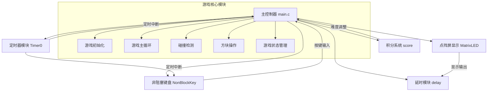

**详解**：
1. **主控制器 (main.c)**
- 游戏核心逻辑和控制中心
- 游戏状态管理（开始/暂停/结束）
- 方块生成、移动和旋转控制
- 游戏区域管理
- 画面绘制调度
- 输入处理

2. **定时器模块 (Timer0)**
- 提供精确的时间基准
- 1ms定时中断
- 驱动键盘扫描
- 控制方块下落节奏
- 管理游戏结束动画

3. **点阵屏显示 (MatrixLED)**
- 8\*8点阵屏驱动
- 74HC595串行数据控制
- 列扫描显示
- 帧缓存管理
- 游戏画面渲染

4. **非阻塞键盘 (NonBlockKey)**
- 4×4矩阵键盘扫描
- 非阻塞式按键检测
- 按键消抖处理
- 按键值映射
- 定时中断驱动扫描

5. **积分系统 (score)**
- 游戏难度管理
- 积分计算与存储
- 消除行数奖励规则
- 动态调整下落速度
- 难度曲线控制（1000ms - 200ms）

6. **延时模块 (delay)**
- 提供精确延时(1ms延时函数)
- 点阵显示同步

### 2.游戏核心流程图
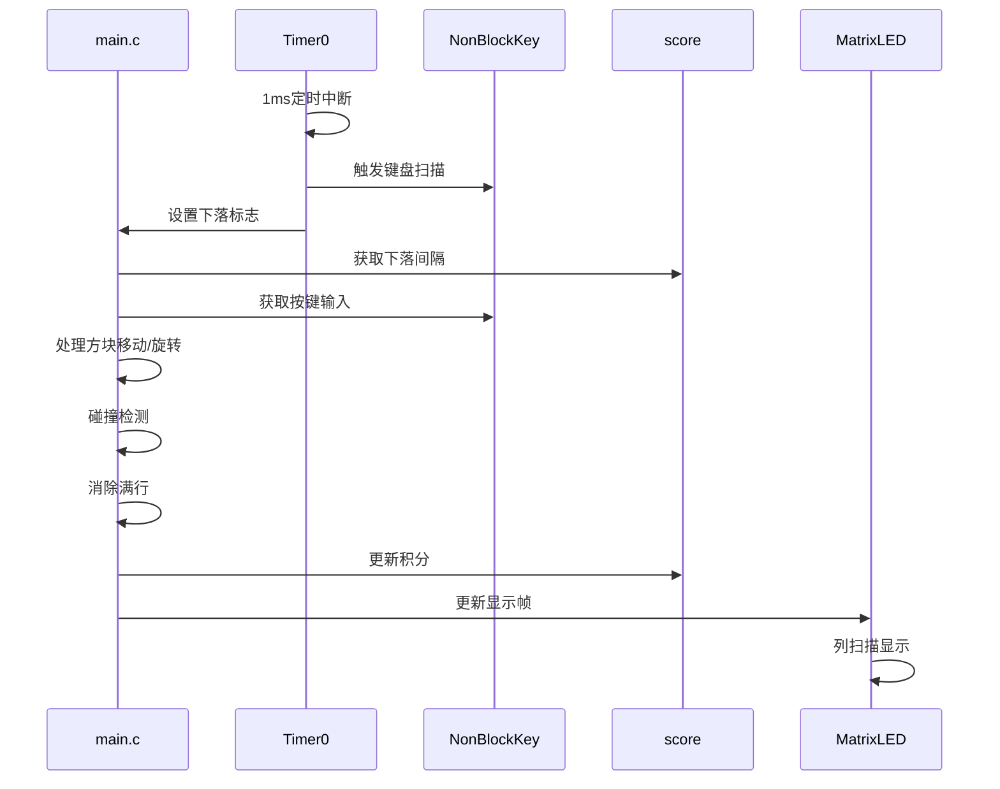

**关键设计特点：**
1. **非阻塞式架构：**
键盘扫描在中断中完成，主循环只处理按键结果，确保游戏流畅运行。

2. **动态难度系统：**
积分越高下落速度越快，消除多行有额外奖励。同时设定速度下限为200ms防止过快。

3. **高效显示机制：**
采用双重缓冲机制（游戏区域+当前方块），列扫描配合短延时。采用中心点渲染算法。

4. **模块化设计：**
各功能独立封装，接口定义清晰，具有低耦合高内聚的特点

5. **资源高优化率：**
采用较为紧凑的方块数据结构（4×4×3×3），同时使用位操作优化显示。复用定时器作为随机种子，减少内存占用。

### 3.整体系统结构框图
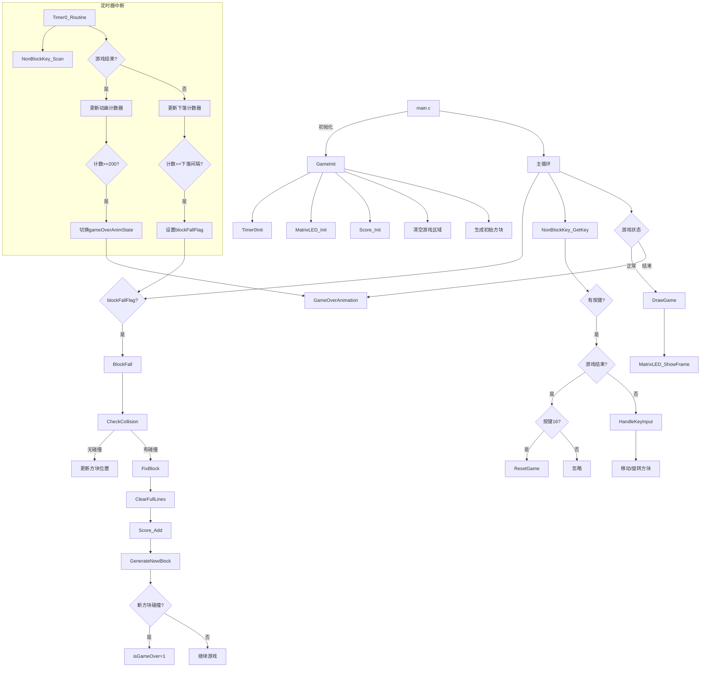

## 四、核心模块解析：
### 1.非阻塞键盘扫描（NonBlockKey.c/h）：
上文我们已经得知矩阵键盘的扫描原理：
1. 列扫描：逐列输出低电平
2. 行检测：读取行线状态
3. 定位按键：当列线为低时，行线为低的位置即按键位置

由此我们可以做出来按键映射表：
|行 \ 列|0 (P1.3)|1 (P1.2)|2 (P1.1)|3 (P1.0)|
|--|--|--|--|--|
|0 (P1.7)|1|5|9|13|
|1 (P1.6)|2|6|10|14|
|2 (P1.5)|3|7|11|15|
|3 (P1.4)|4|8|12|16|

基于此，我们可以做出其具体代码实现：

#### **核心数据结构**：

```c
//列选信号数组，依次选中第1-4列
static unsigned char idata ColPins[] = {0x08, 0x04, 0x02, 0x01};
//按键值映射表
static unsigned char idata KeyMap[4][4] = {
    {1 ,  2,  3,  4},
    {5 ,  6,  7,  8},
    {9 , 10, 11, 12},
    {13, 14, 15, 16}
};

static unsigned char idata keyState[4][4] = {0};  				//按键状态 0-未按下 1-按下
static unsigned char idata keyDebounce[4][4] = {0};				//消抖计数
static unsigned char currentKey = 0;       						//当前按键值
static unsigned char scanCol = 0;         						//当前扫描列

```
#### **键盘扫描流程图：**
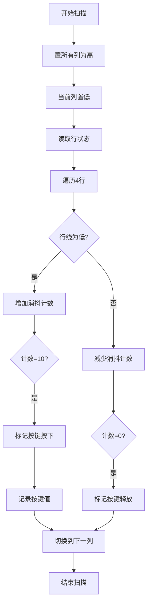

#### 关键函数解析：
##### `NonBlockKey_Scan()`
```c
/**
 * @brief  定时器中断中调用的键盘扫描函数
 * @param  无
 * @retval 无
 */
void NonBlockKey_Scan(void) {
    unsigned char row, rowVal;
    
    //先将所有列置高，再将当前列置低
    P1 = 0xFF;
    P1 &= ~ColPins[scanCol];
    
    //读取行状态
    rowVal = (P1 >> 4) & 0x0F; // 取P1_7-P1_4的值
    
    //检测每一行
    for(row = 0; row < 4; row++) {
        if(!(rowVal & (1 << (3 - row)))) {
            //按键按下，增加消抖计数
            if(keyDebounce[row][scanCol] < 10) {
                keyDebounce[row][scanCol]++;
                //消抖计数达到阈值，确认按键按下
                if(keyDebounce[row][scanCol] == 10) {
                    keyState[row][scanCol] = 1;
                    currentKey = KeyMap[row][scanCol];
                }
            }
        } else {
            //按键未按下，重置消抖计数和状态
            if(keyDebounce[row][scanCol] > 0) {
                keyDebounce[row][scanCol]--;
                if(keyDebounce[row][scanCol] == 0) {
                    keyState[row][scanCol] = 0;
                }
            }
        }
    }
    
    //切换到下一列
    scanCol = (scanCol + 1) % 4;
}

```
##### `NonBlockKey_GetKey()`
```c
/**
 * @brief  获取当前按键值（非阻塞，仅返回一次有效按键）
 * @param  无
 * @retval 按键值（1~16，无按键时返回 0）
 */
unsigned char NonBlockKey_GetKey(void) {
    unsigned char temp = currentKey;
    currentKey = 0;  // 读取后清除，确保只获取一次
    return temp;
}
```

#### 设计特点：
##### 非阻塞特性
- 中断驱动：扫描在1ms定时中断中完成
- 主循环无等待：主程序无需等待按键扫描
- 即时响应：按键状态实时更新
##### 消抖机制
|参数|值|说明|
| ----- | - | --- |
|消抖阈值|10|10ms确认按键状态|
|扫描频率|1ms|高精度检测|
|释放检测|递减计数|确保释放状态稳定|
##### 资源占用
|资源类型|使用量|说明|
| ---------- | -------- | ---- |
|RAM|33字节|状态矩阵 + 计数器|
|CPU时间|<0.1%|每次扫描约50μs|
|中断资源|定时器0|1ms中断周期|

#### 实际应用场景：

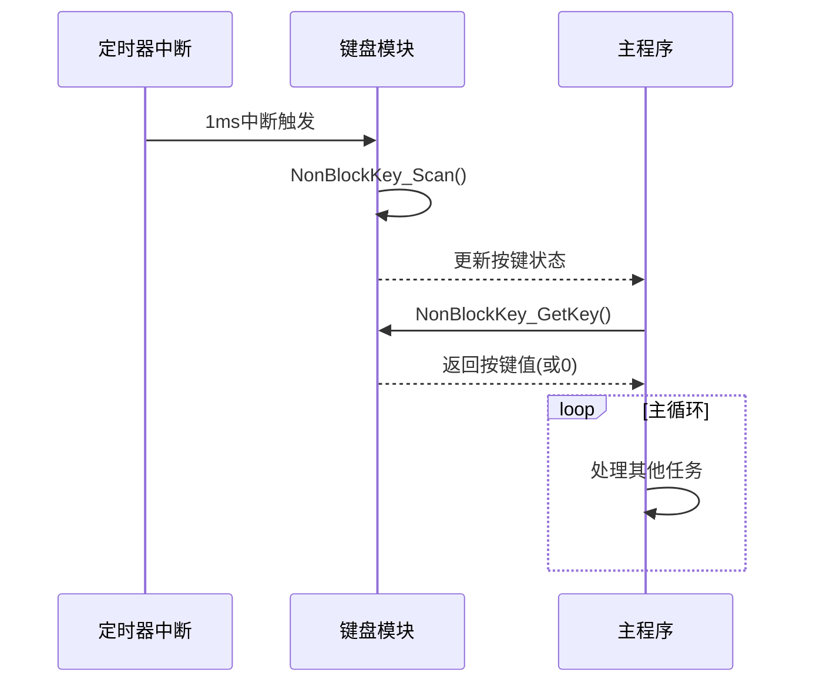

### 2.点阵屏驱动（MatrixLED.c/h）：
同样的，由硬件接线图，我们可以简要概括8\*8点阵屏的扫描显示原理：
1. 列扫描：每次点亮一列（低电平有效）
2. 行控制：通过74HC595输出该列的行数据
3. 视觉暂留：快速扫描所有列（>60Hz）形成完整图像
以及74HC595的工作时序图：

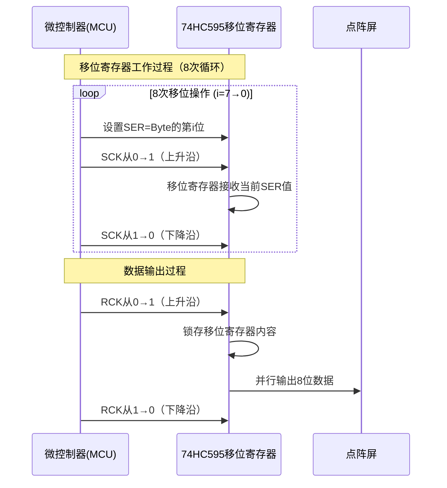

基于以上，我们可以写出对应的代码实现：
#### 核心函数调用关系：

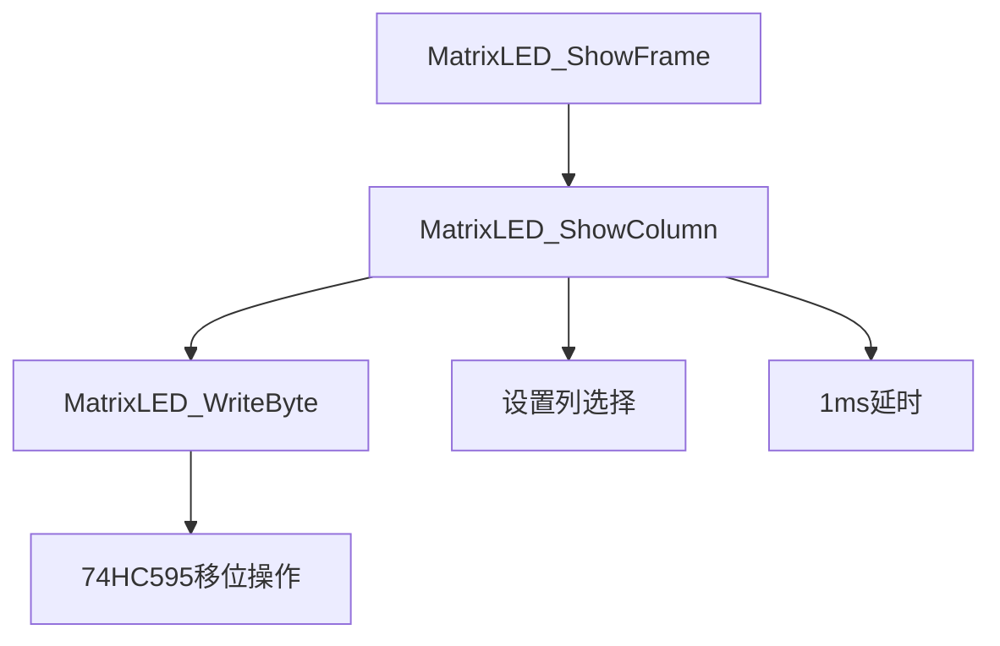

#### 关键函数解析：
##### `MatrixLED_WriteByte()`

```c
/**
 * @brief  向74HC595写入一个字节
 * @param  Byte 要写入的字节
 * @retval 无
 */
void MatrixLED_WriteByte(unsigned char Byte)
{
    unsigned char i;
    for(i = 0; i < 8; i++)
    {
        SER = Byte & (0x80 >> i);  // 取出当前位数据
        SCK = 1;                   // 移位时钟线拉高，数据移入
        SCK = 0;                   // 移位时钟线拉低，准备下一次移位
    }
    RCK = 1;                       // 存储时钟线拉高，数据输出
    RCK = 0;                       // 存储时钟线拉低，准备下一次输出
}

```

##### `MatrixLED_ShowColumn()`

```c
/**
 * @brief  显示点阵屏的一列数据
 * @param  Column 列号，范围0-7，0为最左边
 * @param  Data 列数据，高位在上，低位在下，1为亮，0为灭
 * @retval 无
 */
void MatrixLED_ShowColumn(unsigned char Column, unsigned char Data)
{
    MatrixLED_WriteByte(Data);               // 写入列数据
    MATRIX_LED_PORT = ~(0x80 >> Column);     // 选择列（低电平有效）
    Delay1ms(1);                             // 延时1ms，保证亮度
    MATRIX_LED_PORT = 0xFF;                  // 关闭所有列，防止串扰
}
```

##### `MatrixLED_ShowFrame()`

```c
/**
 * @brief  显示一帧完整的点阵图像
 * @param  Frame 指向图像数据的指针，包含8个字节，每个字节代表一列
 * @retval 无
 */
void MatrixLED_ShowFrame(unsigned char *Frame)
{
    unsigned char i;
    for(i = 0; i < 8; i++)
    {
        MatrixLED_ShowColumn(i, Frame[i]);
    }
}

```

#### 扫描显示流程：
1. 单列显示流程：

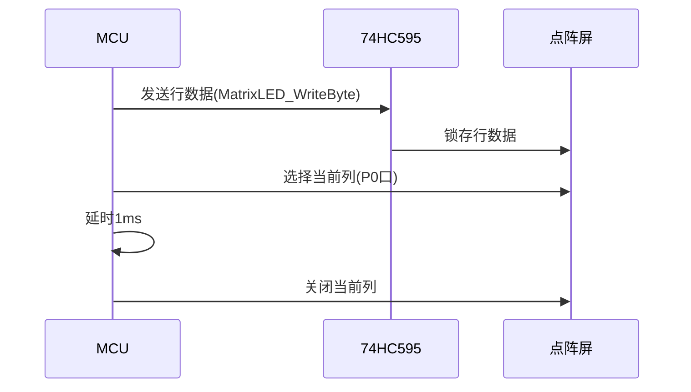

2. 整列显示时序：

为了保证8\*8LED显示屏的亮度稳定，单列显示时间设置为1ms。整帧刷新时间为8ms，即完成所有列扫描所需的时间。基于这一设计，显示屏的刷新率达到125Hz（计算公式为$1/0.008s = 125Hz$）。由于人眼感知连续图像的视觉暂留阈值通常大于24Hz，因此125Hz的刷新率能够确保显示画面流畅无闪烁，为用户提供舒适的视觉体验。

实际应用场景：

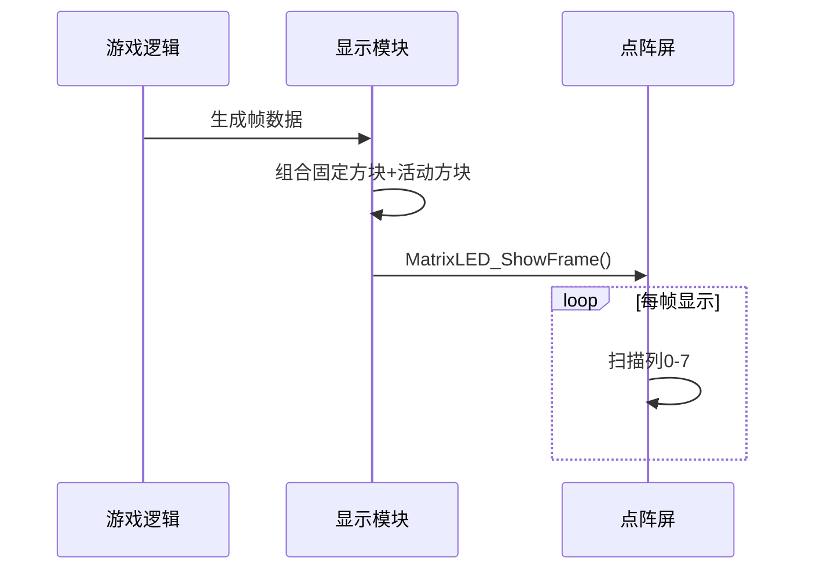

### 3.定时器中断系统：
#### 中断系统架构：

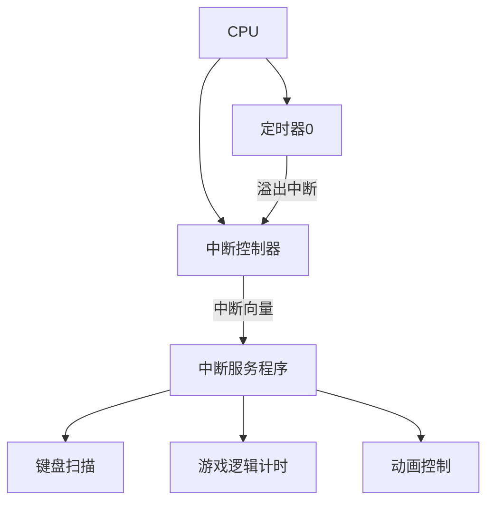

#### 中断服务程序代码：

```c
//定时器中断函数
void Timer0_Routine() interrupt 1{
    static unsigned int T0Count;
    static unsigned int animCount;
    
    //重新赋初值保证计时为1ms
    TL0 = 0x66;				//设置定时初始值
    TH0 = 0xFC;				//设置定时初始值
    
    //键盘扫描（每1ms扫描一次）
    NonBlockKey_Scan();
    
    if(isGameOver){
        //游戏结束时更新动画计数器
        animCount++;
        if(animCount >= 200){  //约200ms切换一次状态
            animCount = 0;
            gameOverAnimState = ~gameOverAnimState;
        }
    }else{
        //正常游戏时处理方块下落
        T0Count++;
        if (T0Count >= Score_GetFallInterval()){
            T0Count = 0; //初始化计数
            blockFallFlag = 1; //置位下落标志
        }
    }
}
```

#### 中断处理流程（Timer0.c/h, main.c）：

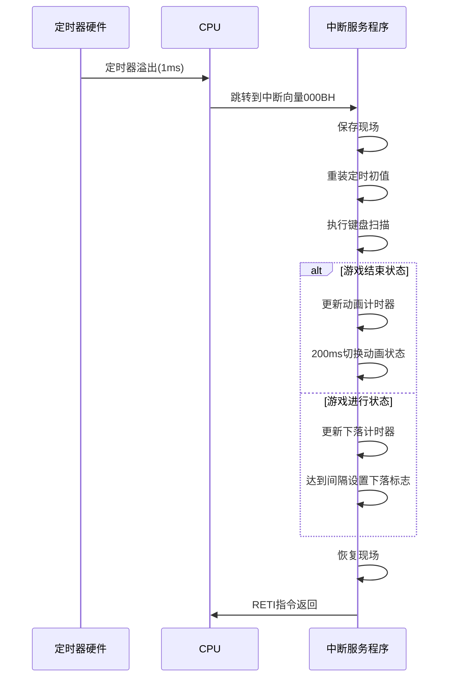

### 4.积分系统
#### 积分系统架构：

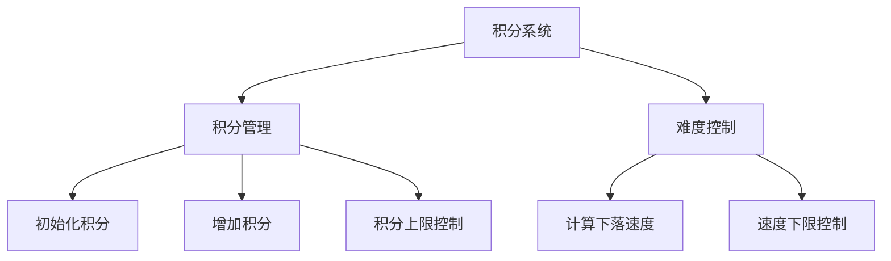

#### 核心组件分析：
1. 数据结构：

```c
// 模块内部变量（私有）
static unsigned int score = 0;          // 积分值
static unsigned int fallInterval = 1000; // 初始下落间隔1000ms
```

2. 积分表：

|消除行数	|得分	|奖励系数|
| -- | -- | -- |
|1行	|1分	|1.0x|
|2行	|3分	|1.5x|
|3行	|6分	|2.0x|

3. 难度曲线公式：
$$
下落间隔 = 1000 - (积分 / 10) * 100\\
最小间隔 = 200ms
$$
#### 函数实现详解：
##### `Score_Init()`

```c
/**
 * @brief 初始化积分系统
 */
void Score_Init() {
    score = 0;
    fallInterval = 1000;
}
```
**功能：**
- 积分归零
- 下落间隔恢复默认值1000ms
##### `Score_Add()`

```c
/**
 * @brief 根据消除行数增加积分
 * @param lines 消除的行数（1-3）
 */
void Score_Add(unsigned char lines) {
    // 积分规则：多消行奖励递增
    switch(lines) {
        case 1: score += 1; break;
        case 2: score += 3; break;
        case 3: score += 6; break;
    }
    // 限制最大积分（防止溢出）
    if(score > 9999) score = 9999;
    // 更新难度（下落速度）
    Score_GetFallInterval();
}
```
**功能：**
- 应用多行消除奖励规则
- 限制最大积分9999
- 更新下落速度

##### `Score_GetFallInterval()`

```c
/**
 * @brief 根据积分计算下落间隔（难度曲线）
 * @return 下落间隔（ms），最低200ms
 */
unsigned int Score_GetFallInterval() {
    // 每增加10分，速度提升100ms（原初始间隔1000ms保持不变）
    unsigned int newInterval = 1000 - (score / 10) * 100;
    // 限制最低间隔为200ms，保持原样
    fallInterval = (newInterval < 200) ? 200 : newInterval;
    return fallInterval;
}
    
```

**功能：**
- 每10分加速100ms
- 最低速度200ms
- 返回当前下落间隔

设计的难度曲线如下表：
|积分区间	|下落间隔	|速度提升|
| -- | -- | -- |
|0-9分	|1000ms	|基准速度|
|10-19分	|900ms	|+11.1%|
|20-29分	|800ms	|+25%|
|...	|...	|...|
|80-89分	|200ms	|+400%|
|≥90分	|200ms	|最大速度|

#### 系统集成关系：

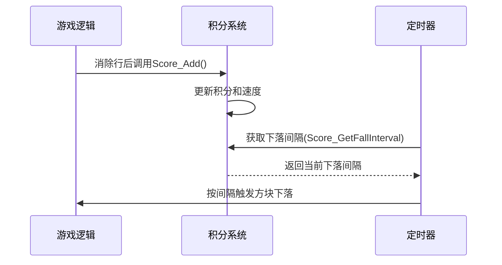

## 五、主程序框架：
### 整体架构设计思想
俄罗斯方块游戏的主程序采用了一个经典的**前台-后台系统**架构。前台由定时器中断服务程序(ISR)构成，负责处理实时性要求高的任务；后台则是主循环，负责处理游戏逻辑和状态管理。这种架构在嵌入式系统中非常常见，能够有效平衡实时性需求和系统资源限制。

整个系统围绕一个**核心状态机**展开，游戏的不同状态（初始化、进行中、暂停、结束）决定了程序的行为路径。主循环通过检查标志位和事件触发来驱动状态转换，而中断服务程序则负责周期性任务的执行和事件标志的设置。

### 初始化阶段：
游戏启动后首先执行`GameInit()`函数。

```c
/**
 * @brief  初始化游戏状态
 * @param  无
 * @retval 无
 */
void GameInit(){
		unsigned char col, row;
    isGameOver = 0;
    isPaused = 0;
    gameOverAnimCount = 0;
    gameOverAnimState = 0;
		Score_Init();				//积分系统初始化
    Timer0Init();					//定时器初始化
    MatrixLED_Init();				//8*8点阵屏初始化
    srand(TH0);						//以定时器初始值作为随机数种子
    
    //清空游戏区域
    for(col = 0; col < GAME_WIDTH; col++){
        for(row = 0; row < GAME_HEIGHT; row++){
            gameArea[col][row] = 0;
        }
    }
    
    //初始化方块生成
    curBlockType = rand() % 4;
    curRotate = rand() % 4;
    curX = 3;			//X初值
    curY = 7;			//Y初值
    nextBlockType = rand() % 4;
}
```

初始化过程设计了游戏的起点状态：积分清零、定时器开始工作、显示系统就绪、游戏区域清空，并随机生成第一个方块及其旋转状态。特别值得注意的是随机种子的设置——它利用定时器TH0寄存器的值作为种子，较为简易地完成了方块随机序列的生成。

### 主循环：
初始化完成后，程序进入`while`循环的主逻辑：

```c
void main(){
    //游戏初始化
    GameInit();
    
    //游戏主循环
    while(1){
        //处理定时下落
        if(blockFallFlag == 1){
            blockFallFlag = 0;
            BlockFall();
        }
        
        //处理键盘输入
        key = NonBlockKey_GetKey();  //使用非阻塞键盘函数
        if(key != 0){
            if(isGameOver){
                //游戏结束时，按16号键重新开始
                if(key == 16){
                    ResetGame();
                }
            }else{
                HandleKeyInput(key);
            }
        }
        
        //绘制画面
        if(isGameOver){
            GameOverAnimation();
        }else{
            DrawGame();
        }
    }
}

```
这个主循环由三个核心活动构成：
- **方块下落处理**：当定时器设置的下落标志触发时，执行下落逻辑
- **输入处理**：非阻塞式获取按键，根据游戏状态执行不同操作
- **画面渲染**：根据游戏状态显示正常画面或结束动画

此设计确保了即使在没有事件发生时，CPU也不会空转，而是持续刷新显示，保持画面流畅。

### 方块运动逻辑:
#### 自动下落与碰撞检测函数`BlockFall()`

```c
/**
 * @brief  处理方块下落逻辑
 * @param  无
 * @retval 无
 */
void BlockFall(){
    if(isGameOver || isPaused){  //游戏结束或暂停时不处理
        return;
    }
    
    //计算下落后的Y坐标
    newY = curY - 1;
    
    if(!CheckCollision(curX, newY)){  //无碰撞，允许下落
        curY = newY;
    }else{  //有碰撞，固定当前方块并生成新方块
        FixBlock();
        ClearFullLines();  //检查并消除已满的行
        GenerateNewBlock();
    }
}
```

方块下落是游戏的驱动力。每次下落尝试前会进行碰撞检测：检测是否超出左右边界（X轴）、底部边界（Y轴）以及是否与已固定的方块重叠

#### 玩家控制：移动与旋转

```c
/**
 * @brief  方块左移
 * @param  无
 * @retval 无
 */
void BlockMoveLeft(){
    if(isGameOver || isPaused) return;  //游戏结束或暂停时不响应
    newX = curX - 1;      //计算左移后的X坐标
    if(!CheckCollision(newX, curY)){    //检测无碰撞则移动
        curX = newX;
    }
}

/**
 * @brief  方块右移
 * @param  无
 * @retval 无
 */
void BlockMoveRight(){
    if(isGameOver || isPaused) return;
    newX = curX + 1;      //计算右移后的X坐标
    if(!CheckCollision(newX, curY)){    //检测无碰撞则移动
        curX = newX;
    }
}

/**
 * @brief  方块下移
 * @param  无
 * @retval 无
 */
void BlockMoveDown(){
    if(isGameOver || isPaused) return;
    newY = curY - 1;      //计算下移后的X坐标
    if(!CheckCollision(newX, curY - 1)){    //检测无碰撞则移动
        curY = newY;
    }
}

/**
 * @brief  方块旋转（顺时针）
 * @param  无
 * @retval 无
 */
void BlockRotate(){
		unsigned char oldRotate;
    if(isGameOver || isPaused) return;
    oldRotate = curRotate;          //保存当前旋转状态
    curRotate = (curRotate + 1) % 4;              //计算新旋转状态（0-3循环）
    if(CheckCollision(curX, curY)){               //若旋转后碰撞
        curRotate = oldRotate;                    //恢复原旋转状态
    }
}
```

玩家控制逻辑同样基于碰撞检测，确保所有操作都不会导致方块进入非法位置。旋转操作特别采用了"**先尝试后回滚**"的策略，避免出现不可旋转的情况。

### 游戏状态转换：
游戏状态通过几个关键标志位管理：

```c
bit isGameOver = 0;																									//游戏结束标志
bit isPaused = 0;																										//游戏暂停标志
bit blockFallFlag = 0;																							//方块下落标志
bit gameOverAnimState = 0;																					//游戏结束动画状态
```

状态转换发生在以下关键节点：
- 新方块生成时碰撞 → 设置`isGameOver = 1`
- 玩家按下暂停键 → 切换`isPaused`
- 玩家按下重启键 → 调用`ResetGame()`
- `isGameOver = 1` → 设置`gameOverAnimState = 1`

状态转换图如下：

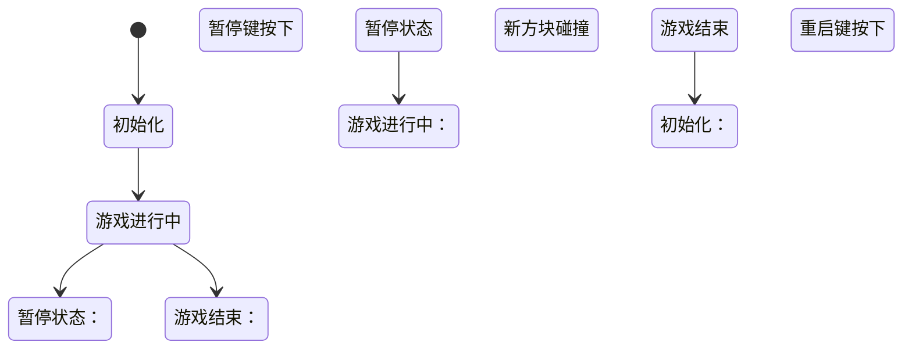

### 渲染系统：
画面渲染采用分层绘制策略：

```c
/**
 * @brief  绘制游戏画面
 * @param  无
 * @retval 无
 */
void DrawGame(){
    unsigned char frame[8] = {0};  //帧缓存，8列，每列1字节（bit7=最上行，bit0=最下行）
    unsigned char col, row, r, c, realCol, realRow;
		
    //1.绘制游戏区域中已固定的方块
    for(col = 0; col < GAME_WIDTH; col++){
        for(row = 0; row < GAME_HEIGHT; row++){
            if(gameArea[col][row] == 1){
                //行号row对应bit位（row=0→bit0，row=7→bit7），置1表示点亮
                frame[col] |= (1 << row);
            }
        }
    }
    
    //2.绘制当前活动方块（3x3矩阵）
    for(r = 0; r < 3; r++){  //遍历方块的3行
        for(c = 0; c < 3; c++){  //遍历方块的3列
            //若方块当前位置有像素（1表示有方块）
            if(Block[curBlockType][curRotate][r][c] == 1){
                //计算实际坐标（以方块中心为基准偏移，3x3矩阵中心在(1,1)）
                realCol = curX + (c - 1);  //列坐标：当前列 + 列偏移
                realRow = curY + (r - 1);  //行坐标：当前行 + 行偏移
                
                //确保坐标在8x8点阵范围内（防止越界）
                if(realCol < GAME_WIDTH && realRow < GAME_HEIGHT){
                    frame[realCol] |= (1 << realRow);  //点亮对应像素
                }
            }
        }
    }
    
    //3.显示最终帧缓存
    MatrixLED_ShowFrame(frame);
}
```
这种分层渲染确保了活动方块总是显示在固定方块的上方，符合视觉逻辑。游戏结束时的动画则采用交替列点亮的方式，创建出闪烁效果：

```c
/**
 * @brief  游戏结束动画
 * @param  无
 * @retval 无
 */
void GameOverAnimation(){
    unsigned char frame[8] = {0};
    unsigned char col;
    
    //根据动画状态设置帧
    for(col = 0; col < 8; col++){
        //交替显示列
        if((col % 2) == gameOverAnimState){
            frame[col] = 0xFF;  //点亮整列
        }else{
            frame[col] = 0x00;  //熄灭整列
        }
    }
    
    MatrixLED_ShowFrame(frame);
}
```

### 定时器中断：
定时器中断服务程序是游戏的时间基准：

```c
//定时器中断函数
void Timer0_Routine() interrupt 1{
    static unsigned int T0Count;
    static unsigned int animCount;
    
    //重新赋初值保证计时为1ms
    TL0 = 0x66;				//设置定时初始值
    TH0 = 0xFC;				//设置定时初始值
    
    //键盘扫描（每1ms扫描一次）
    NonBlockKey_Scan();
    
    if(isGameOver){
        //游戏结束时更新动画计数器
        animCount++;
        if(animCount >= 200){  //约200ms切换一次状态
            animCount = 0;
            gameOverAnimState = ~gameOverAnimState;
        }
    }else{
        //正常游戏时处理方块下落
        T0Count++;
        if (T0Count >= Score_GetFallInterval()){
            T0Count = 0; //初始化计数
            blockFallFlag = 1; //置位下落标志
        }
    }
}
```

这个1ms的定时中断承担了多项任务：
- 键盘扫描（确保按键响应及时）
- 游戏结束动画的状态更新
- 方块下落标志的设置

其中还值得注意的是下落间隔的计算：`Score_GetFallInterval()`根据当前积分返回下落间隔，实现了随着分数增加游戏难度提升的效果。

### 模块协同
整个游戏的运行如同精心编排的交响乐，各模块协同工作：
- 定时器模块：提供时间基准和中断驱动
- 输入模块：非阻塞式键盘扫描
- 显示模块：点阵屏控制
- 游戏逻辑：状态管理、碰撞检测、规则执行
- 积分系统：难度动态调整

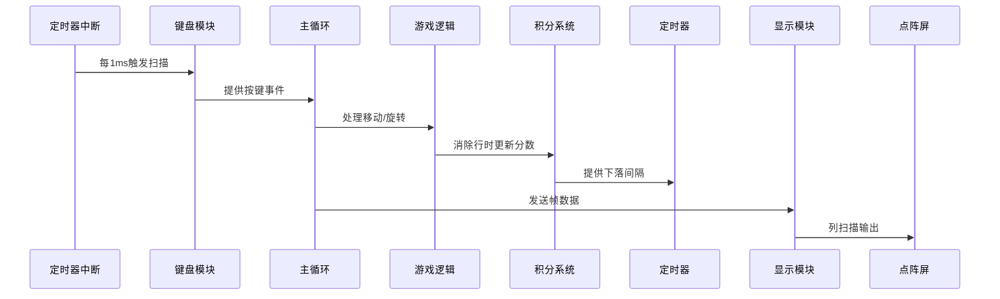

本主程序框架体现了几个重要的嵌入式系统设计原则：
1. **非阻塞设计**：避免任何形式的忙等待
2. **事件驱动**：响应外部事件而非轮询
3. **状态机管理**：清晰的状态转换逻辑
4. **模块解耦**：高内聚低耦合的组件设计

## 六、总结与展望：
经过本次完整的俄罗斯方块项目开发，我们成功在资源受限的51单片机平台上实现了一款功能完备的经典游戏。此项目不仅是对嵌入式系统开发技术的全面实践，更是对软硬件协同设计理念的生动诠释。

### 技术成果亮点
我们构建了一个高效可靠的嵌入式游戏引擎，其核心创新在于：
- 实现了非阻塞式键盘扫描算法，在1ms定时中断中完成按键消抖处理，确保主循环不被I/O操作阻塞
- 开发了优化的点阵屏驱动架构，通过74HC595串行转并行技术，以最小引脚资源驱动8×8点阵
- 设计了动态难度调节系统，积分每增加10分，下落速度提升100ms，最低200ms封顶
- 创建了分层渲染引擎，将固定方块与活动方块分离绘制，实现视觉层次感
- 构建了基于碰撞检测的状态机系统，优雅处理游戏状态转换

### 架构设计优势
项目采用模块化分层架构，各组件职责清晰：
- 硬件抽象层(`MatrixLED/Timer0`)封装硬件操作细节
- 系统服务层(`NonBlockKey/delay`)提供基础功能
- 游戏逻辑层(`score/main`)实现核心算法
- 应用层整合所有模块实现完整游戏

这种架构使代码复用率高达70%，例如点阵驱动模块可直接用于其他显示项目，键盘模块可应用于各类输入系统。

### 目前不足与未来可拓展方向
**不足**：代码不够简洁，数据结构有些臃肿，未来可尝试全新数据结构存储方块状态。受限于数码管和8\*8点阵屏的段口冲突（均为P0口），笔者实力有限，无法通过实现**时间片轮询（Round Robin Scheduling）调度算法**来同时地清晰显现出数码管和点阵屏LED（频闪效果太严重了），因而没有写用数码管实现玩家当前所得积分的功能（模块部分兼容性较好，稍加改进即可，主要需要改动的是定时器中断函数部分。数码管模块也在附件中一并给出）
**未来可拓展方向**：
1. 添加方块预览功能
2. 实现高分存储（EEPROM）以及分数显示
3. 增加音效反馈
4. 开发多级难度系统，并支持玩家进行初始难度选择
5. 添加游戏开始动画
